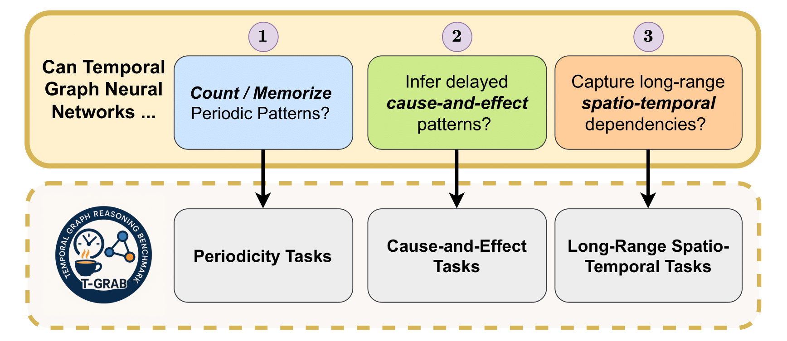

# T-GRAB ☕ : A Synthetic Reasoning Benchmark for Learning On Temporal Graphs

📊	[Datasets](https://drive.google.com/file/d/12lSbmrfatKGQUx8WWbPpbH4DsyzDLycr/view?usp=drive_link)

This repository contains the implementation of the T-GRAB framework, a comprehensive set of synthetic tasks specifically designed to systematically evaluate the reasoning capabilities of Temporal Graph Neural Networks (TGNNs) over time. The framework offers controlled and interpretable tasks that target three core temporal reasoning skills:
a) Counting and memorizing periodic repetitions (periodicity),
b) Inferring delayed causal effects (cause_effect), and
c) Capturing long-range dependencies across both spatial and temporal dimensions (long_range).

The framework has been tested with various TGNN architectures including:
- CTDG-based models: DyGFormer, TGN, TGAT, CTAN
- DTDG-based models: GCN, GCLSTM, TGCN, GAT, EGCN
- Baseline methods: EdgeBank, Previous


The code can be used to reproduce the results from the original paper.

## Reproduce the results
### Installation
To get started with T-GRAB, follow these installation steps:

1. Navigate to the T-GRAB directory
2. Create and activate a Python virtual environment
3. Install the required dependencies

```bash
cd .../T-GRAB
python -m venv tgrab
pip install -r requirements.txt 
```
### Dataset generation
There are two ways to generate datasets in T-GRAB:

1. **Quick Generation**
   - Use the `sample.sh` scripts located in `scripts/dataset/`
   - This is suitable for quick testing and small datasets

2. **Slurm-based Generation**
   - Use `all_in_one.sh` scripts for distributed dataset creation
   - Configure dataset parameters in the script before running

   ```bash
   # For periodicity tasks
   ./scripts/dataset/periodicity/all_in_one.sh [sbm] [fixed_er]
   # sbm: stochastic periodicity
   # fixed_er: deterministic periodicity
   # You can run either one or both arguments together

   # For cause-effect tasks
   ./scripts/dataset/cause_effect/all_in_one.sh

   # For long-range dependency tasks
   ./scripts/dataset/long_range/all_in_one.sh
   ```

The generated datasets are:
- Stored in `scratch/data/` directory by default
- Saved in numpy compressed format for training
- Available in CSV format on [Hugging Face](https://huggingface.co/datasets/Gilestel/T-GRAB)

### Training
The training scripts are located in the `scripts/task/` directory, which contains three main tasks:
- `cause_effect`: For inferring delayed causal effects
- `long_range`: For capturing long-range dependencies
- `periodicity`: For counting and memorizing periodic repetitions

#### Prerequisites
1. Login to your Weights & Biases account:
   ```bash
   wandb login
   ```
2. Activate the Python environment:
   ```bash
   source tgrab/bin/activate
   ```

#### Running Experiments
For each task, two script files are provided: `slurm.sh` for submitting batches of jobs via Slurm, and `bash.sh` for running experiments sequentially. Both scripts list all the required method configurations and come pre-configured with default values for three types of variables, which you can modify to customize your experiments:

1. **Running-specific Variables** (common across all tasks):
   ```bash
   EVAL_MODE=false               # Set to true for evaluation-only mode
   METHODS_TO_RUN=(              # List of methods to run
       "CTDG/_dygformer"
       "CTDG/_tgn"
       "CTDG/_tgat"
       "CTDG/_ctan"
       "DTDG/_gcn"
       "DTDG/_gclstm"
       "DTDG/_tgcn"
       "DTDG/_gat"
       "DTDG/_egcn"
       "CTDG/_edgebank"
       "DTDG/_previous"
   )
   CLEAR_RESULT=false            # Set to true to start training from scratch
   WANDB_ENTITY="your-username" # Your Weights & Biases username
   ```

2. **Dataset-specific Variables:**
   Specify which datasets to use for training and evaluation. Adjust these variables according to your experimental needs.

3. **Model-specific Variables:**
   Models are grouped into five categories, each with its own set of hyperparameters:
   - **edgebank**
   - **CTDG (excluding CTAN)**
   - **CTAN**
   - **DTDG**
   - **persistence**
   
   Refer to the script file for the relevant hyperparameter blocks for each model type.

Now, to run experiments for each task, use the following commands. Replace `[slurm | bash]` with either `slurm` (for Slurm batch jobs) or `bash` (for sequential runs) as appropriate:

- **Periodicity:**
  ```bash
  ./scripts/task/periodicity/slurm.sh [sbm] [fixed_er]
  # or
  ./scripts/task/periodicity/bash.sh [sbm] [fixed_er]
  ```
  - Use `sbm` for stochastic periodicity and `fixed_er` for deterministic periodicity. You can specify one or both.

- **Cause-effect and Long-range:**
  ```bash
  ./scripts/task/cause_effect/slurm.sh
  # or
  ./scripts/task/cause_effect/bash.sh

  ./scripts/task/long_range/slurm.sh
  # or
  ./scripts/task/long_range/bash.sh
  ```

You can find the model results and checkpoints in the `scratch/res` directory.
